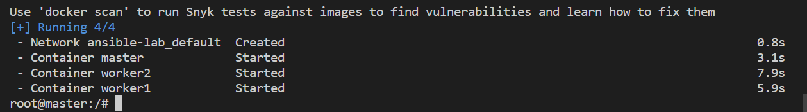
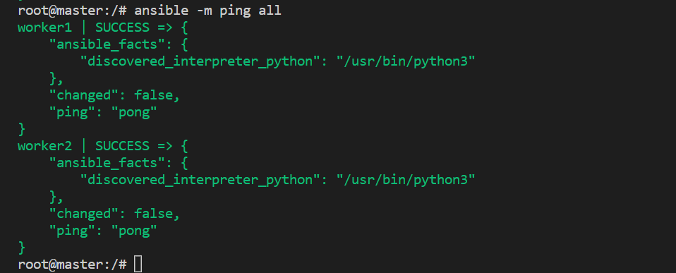

## Ansible lab

A docker lab to play around with Ansible. The lab contains one master container and 2 workers to execute ansible commands. 

PS: Do no use windows to launch this docker-compose file. It has bugs that prevent mounting folders to containers. Switch to a WSL terminal to use this project.

This setup uses pre-made SSH key pairs present in the `shared` folder. To start just run the `start.sh` script and you will land in a shell on the master node. From there, you can run ansible right off the bat; without any setup.

